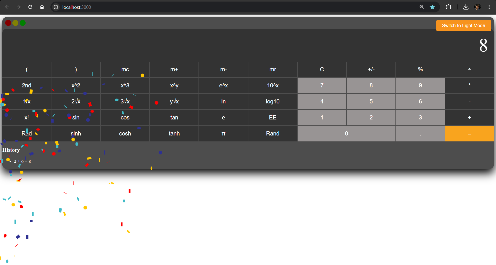

# Confetti-Calculator

## WebPage Link Of Netlify ->
https://confetti-calculator-roshan.netlify.app/

## Screenshot 


## Installation

To run this project locally, follow these steps:

1. Clone the repository:

   ```bash
   git clone https://github.com/your-username/calculator-app.git
   cd calculator-app
   ```

2. Install dependencies:

   ```bash
   npm install
   ```

3. Start the development server:

   ```bash
   npm start
   ```

4. Open your browser and visit `http://localhost:3000` to use the calculator.